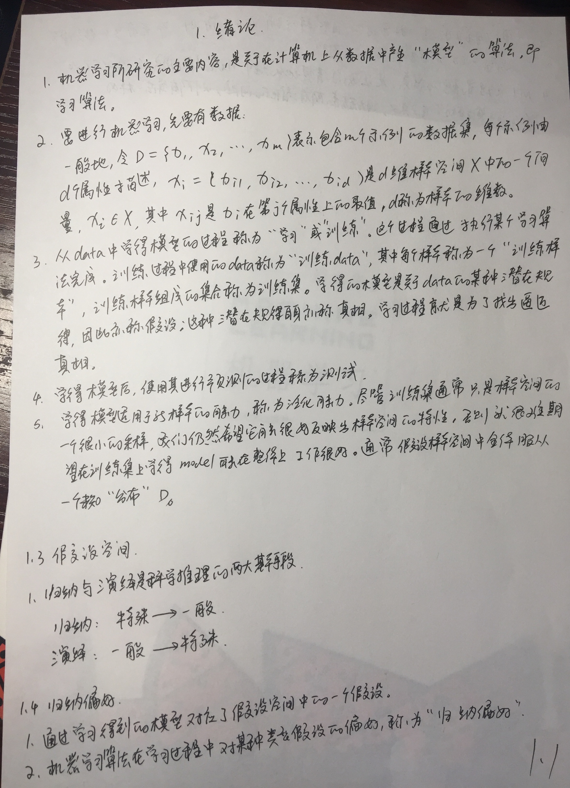
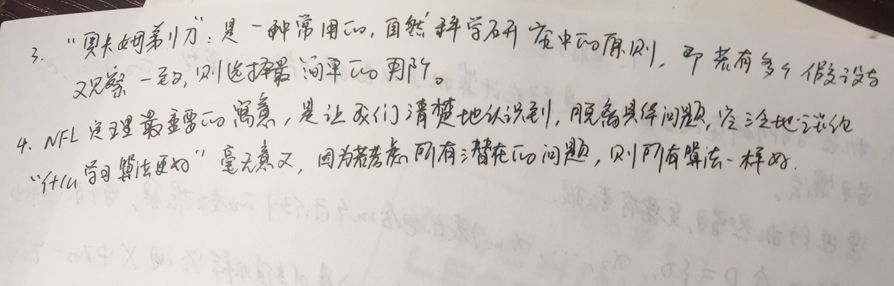

## 写在前面






## 手写笔记





### 机器学习基础

> 尽管训练集通常只是样本空间的一个很小的采样，我们仍然希望它能很好地反应样本空间特性，
否则就很难期望在训练集上学得的模型在整个样本空间中都工作得很好。通常假设样本空间中全体样本服从一个未知的分布D，
我们获取的每个样本都是独立从这个分布采样，一般而言，训练样本越多，我们获得的关于D的信息越多，
这样就越有可能通过学习获得具有强的泛化能力的模型。

* 两种类型
    * 标称型：分类
    * 数值型：回归
* 分类
    * K近邻：使用某种距离计算方法进行分类
    * 决策树：比较直观，容易理解，但相对难于实现
    * 使用概率论建立分类器
    * Logistic回归：使用最优参数正确分类原始数据，在搜索最优参数的过程中，将使用几个经常用到的优化算法
    * SVM
    * 元算法-AdaBoost：由若干分类器构成；
    
监督学习的用途  |------------|
------------    | ----------  |
K近邻算法       |   线性回归 
朴素贝叶斯算法  |   局部加权线性回归 
支持向量机      |   Ridge回归
决策树          |  Lasso最小回归系数估计

-----

无监督学习的用途|------------|
------------   | ----------  |
k均值         |   最大期望算法 
DBSCAN       |   Parzen窗设计



### 如何选择合适的算法

* 需要确定目标类型，如果目标变量是离散型，则可以选择分类算法，如果目标变量是连续性数值，则需要选择回归算法，
* 如果不想预测目标变量的值，则可以选择无监督学习算法，进一步分析是否需要将数据划分为离散的组。如果这是唯一的需求，
则使用聚类算法；如果还需要估计数据与每个分组的相似程度，则需要使用密度估计算法。



### 开发机器学习应用程序的步骤

1. 收集数据；
2. 准备输入数据；
3. 分析输入数据：此步骤主要是人工分析以前得到的数据，为了保证前两步有效，最简单的方法是文本编辑器打开数据文件，查看
得到的数据是否为控制。此外，还可以进一步浏览数据，分析是否可以识别出模式；数据中是否存在明显的异常值，如某些数据点与数据
集中的其他值存在明显的差异，通过一维，二维和三维图形展示数据也是不错的方法。
4. 训练算法：
5. 测试算法
6. 使用算法