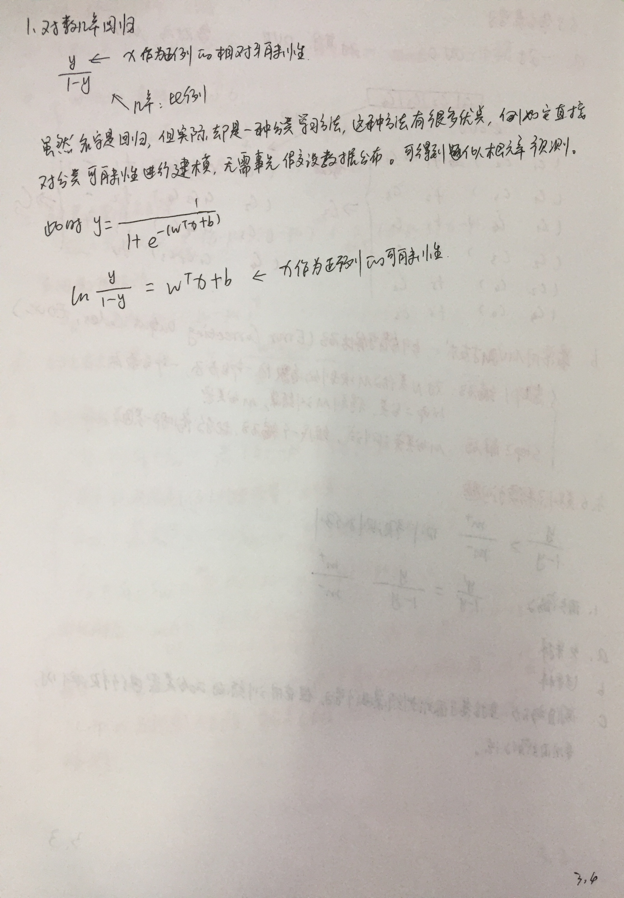
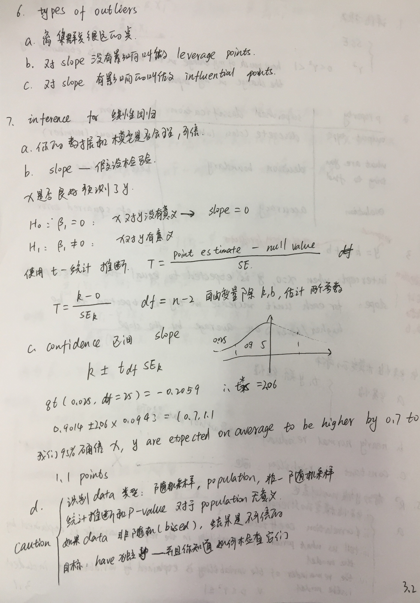
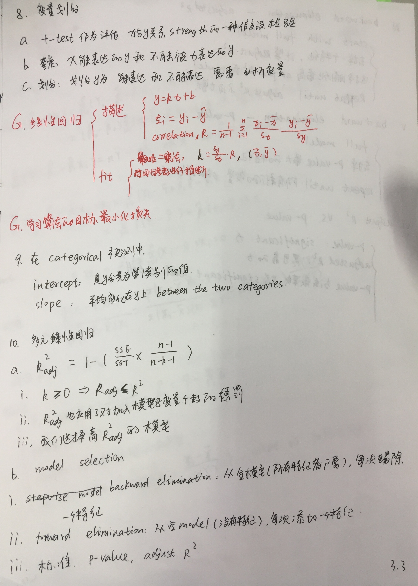
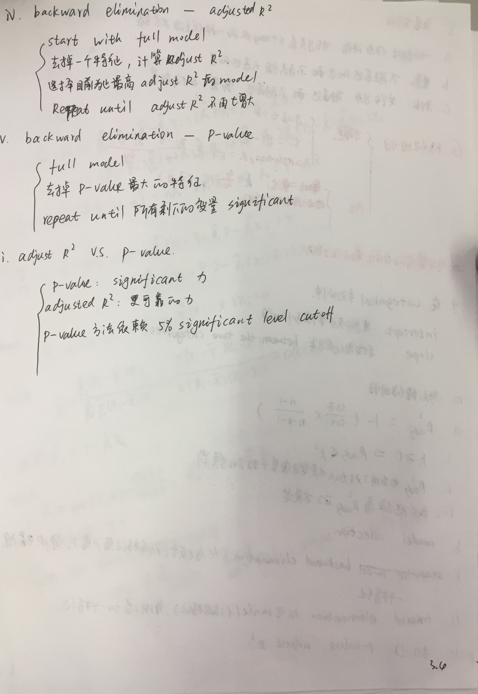
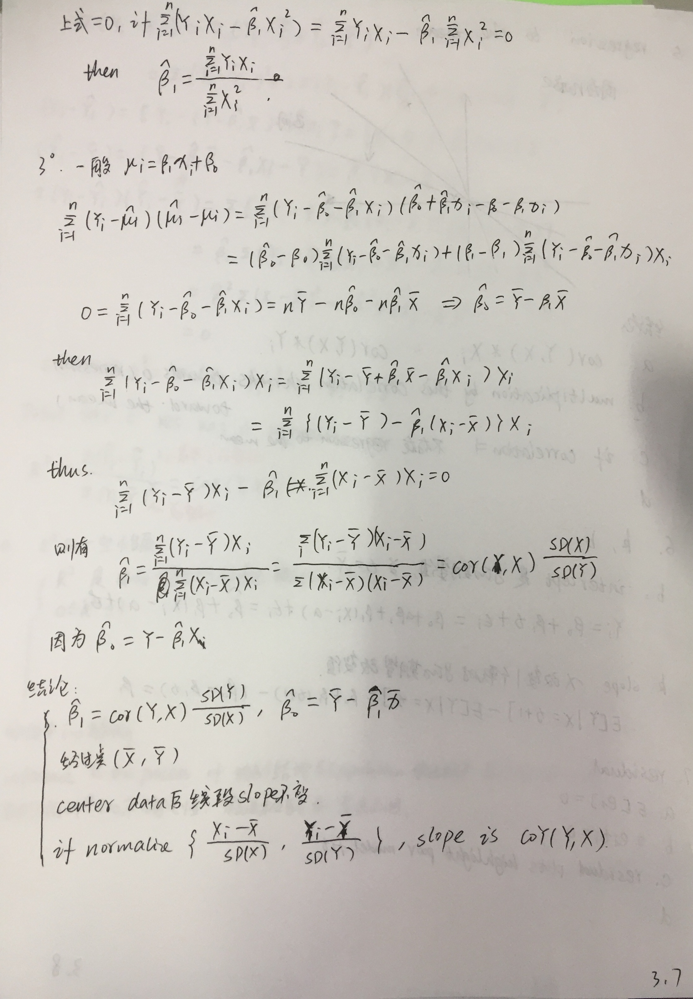
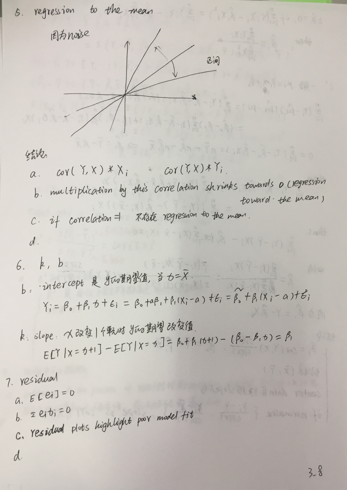
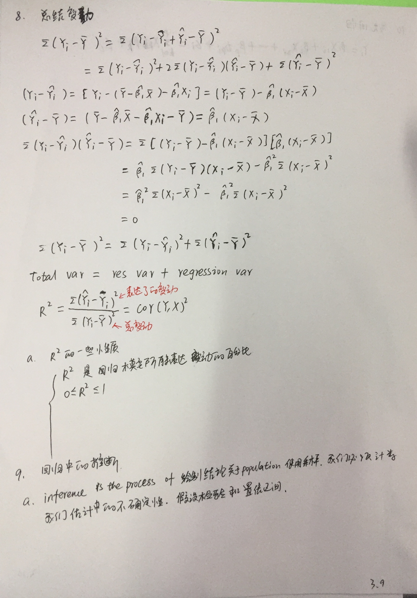
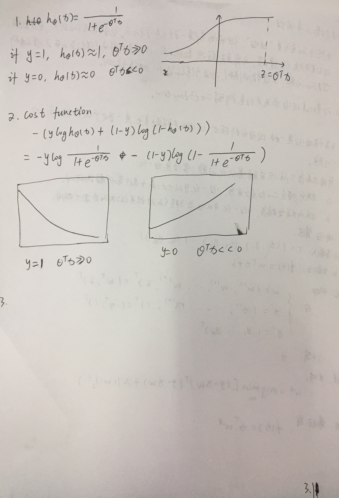

## 写在前面

* 逻辑回归基于分布：回归（拟合样本点的超平面）+sigmoid(变成概率)

* 一般步骤：
    1. 收集数据: 采用任意方法收集数据
    2. 准备数据: 由于需要进行距离计算，因此要求数据类型为数值型。另外，结构化数据格式则最佳。
    3. 分析数据: 采用任意方法对数据进行分析。
    4. 训练算法: 大部分时间将用于训练，训练的目的是为了找到最佳的分类回归系数。
    5. 测试算法: 一旦训练步骤完成，分类将会很快。
    6. 使用算法: 首先，我们需要输入一些数据，并将其转换成对应的结构化数值；接着，
    基于训练好的回归系数就可以对这些数值进行简单的回归计算，判定它们属于哪个类别；
* Logistic回归优点：
    1. 实现简单；
    2. 分类时计算量非常小，速度很快，存储资源低；
* 缺点：
    1. 容易欠拟合，一般准确度不太高
    2. 只能处理两分类问题（在此基础上衍生出来的softmax可以用于多分类），且必须线性可分；

> 解决二分类问题，如果有多分类，可以先二分类，然后继集成，因为每个学习器输出每个样本是正样本的概率，
> 所以可以对于每个样本取最大的学习器的预测结果。这种是分类比较少的情况下使用

* [极大似然估计详解](https://blog.csdn.net/zengxiantao1994/article/details/72787849)
    * 在固定输入下，估计参数
    * 参数是什么的时候，输出最有可能是给定的值，这些参数就是我们要的

* [github code](https://github.com/apachecn/MachineLearning/blob/master/docs/5.Logistic%E5%9B%9E%E5%BD%92.md)
    * 如果目标函数是损失函数，那就是最小化损失函数来求函数的最小值，就用梯度下降。 
    如果目标函数是似然函数（Likelihood function），就是要最大化似然函数来求函数的最大值。
    在逻辑回归中， 损失函数和似然函数无非就是互为正负关系。
    * 处理数据中的缺失值
        * 使用可用特征的均值来填补缺失值；
        * 使用特殊值来填补缺失值，如 -1；
        * 忽略有缺失值的样本；
        * 使用有相似样本的均值添补缺失值；
        * 使用另外的机器学习算法预测缺失值。

​    
* 如要将回归方法应用在分类任务上怎么办？
* y = 1 / (1 + e^-z)
* 是一种 sigmoid 函数
* 优点
    * 是一种分类学习方法
    * 直接对分类可能性进行建模，无需事先假设数据的分布，这样避免了假设分布不准确带来的问题
    * 不仅预测出类别，还得到了近似概率预测，
    * 函数任意阶可导凸函数

* 正例的预测值越大越好，反例的预测值越小越好

## 手写版笔记

### 参考资料

* 体系三门
    * [机器学习角度-回归视频](https://www.coursera.org/learn/ml-regression/home/welcome)
    * [吴恩达机器学习课程-回归](https://www.coursera.org/learn/machine-learning/lecture/wlPeP/classification)
    * [回归基础知识](https://www.coursera.org/learn/regression-models/home/week/1)
        * [对应的课件](linear_model/07_RegressionModels)
            * [Advanced Linear Models for Data Science 1: Least Square](https://www.coursera.org/learn/linear-models/home/info)
            * [Advanced Linear Models for Data Science 2: Statistical Linear Models](https://www.coursera.org/learn/linear-models-2/home/info)
        * [配套书籍-Regression Models for Data Science in R](https://leanpub.com/regmods/read)
        * [配套书籍-Statistical inference for data science](https://leanpub.com/LittleInferenceBook/read)
* 《机器学习实战》回归章节

