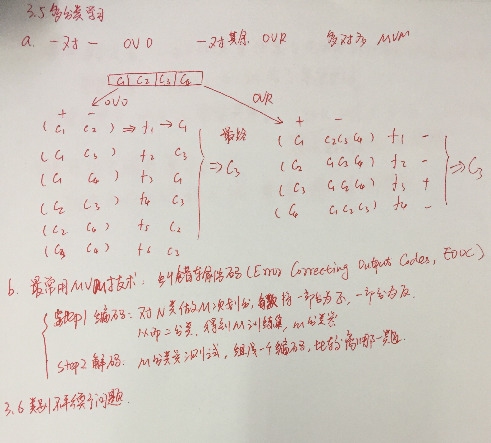
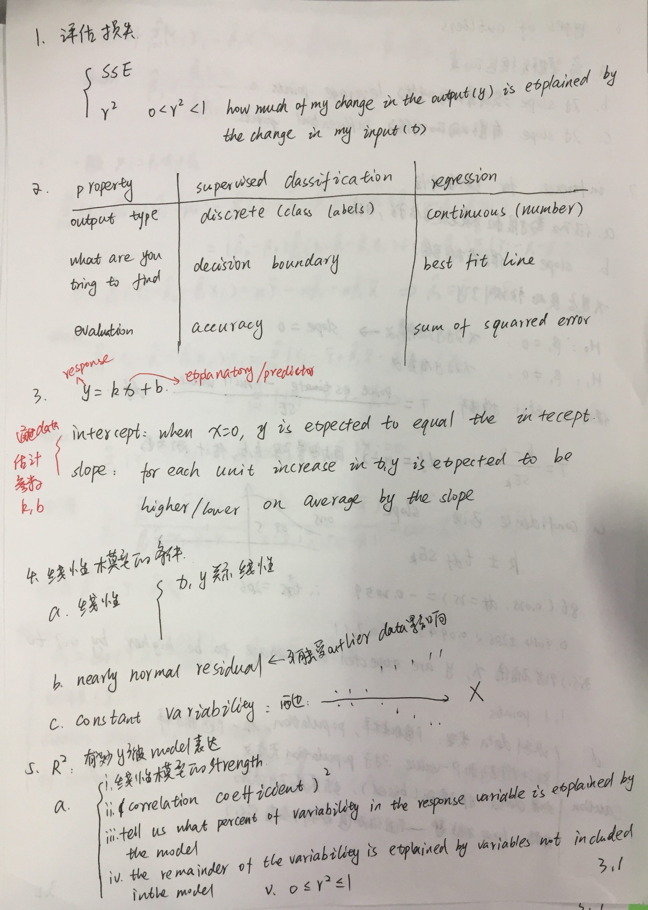
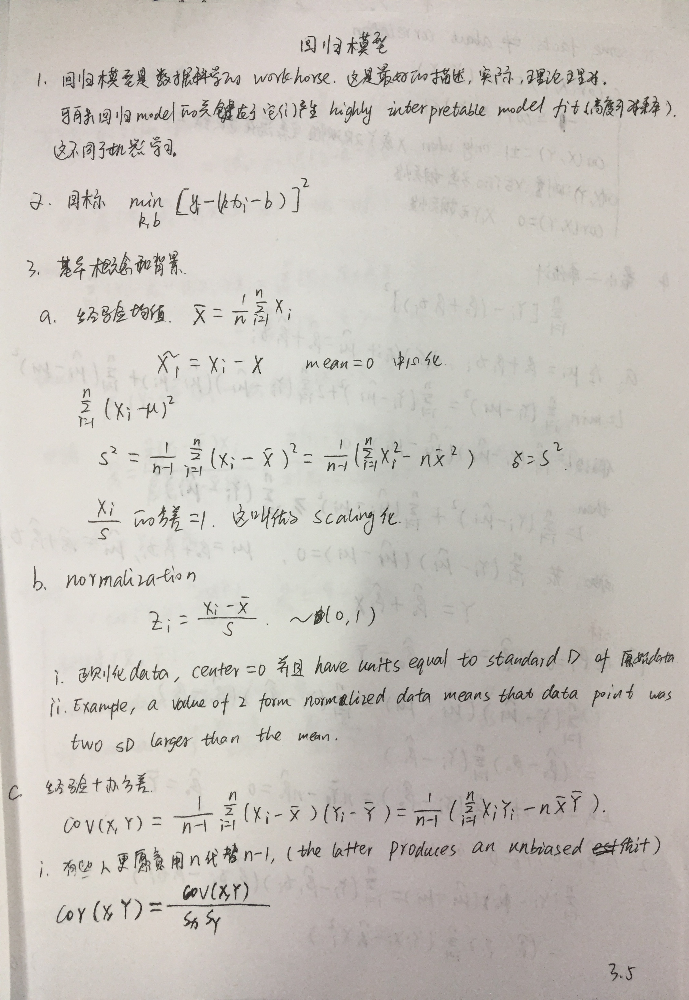
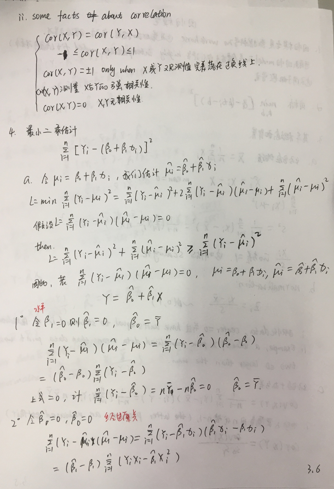

## 手写版笔记
















 
## 线性回归

* 优点： 结果易于理解，计算上不复杂
* 缺点：对非线性数据拟合不好
* 

### 参考资料


* 入门基本概念到编程接口
    * [优达学城 机器学习入门](https://classroom.udacity.com/courses/ud120)
* 体系三门
    * [机器学习角度-回归视频](https://www.coursera.org/learn/ml-regression/home/welcome)
    * [吴恩达机器学习课程-回归](https://www.coursera.org/learn/machine-learning/lecture/wlPeP/classification)
    * [回归基础知识](https://www.coursera.org/learn/regression-models/home/week/1)
    * [对应的课件](linear_model/07_RegressionModels)
    * [Advanced Linear Models for Data Science 1: Least Square](https://www.coursera.org/learn/linear-models/home/info)
    * [Advanced Linear Models for Data Science 2: Statistical Linear Models](https://www.coursera.org/learn/linear-models-2/home/info)
    * [配套书籍-Regression Models for Data Science in R](https://leanpub.com/regmods/read)
    * [配套书籍-Statistical inference for data science](https://leanpub.com/LittleInferenceBook/read)
* 《机器学习实战》回归章节


## 对数几率回归 logistics function

* [Logistic Regression(逻辑回归)详细讲解](https://blog.csdn.net/joshly/article/details/50494548)
* [极大似然估计详解](https://blog.csdn.net/zengxiantao1994/article/details/72787849)
    * 在固定输入下，估计参数
    * 参数是什么的时候，输出最有可能是给定的值，这些参数就是我们要的
* 如要将回归方法应用在分类任务上怎么办？
* y = 1 / (1 + e^-z)
* 是一种 sigmoid 函数
* 优点
    * 是一种分类学习方法
    * 直接对分类可能性进行建模，无需事先假设数据的分布，这样避免了假设分布不准确带来的问题
    * 不仅预测出类别，还得到了近似概率预测，
    * 函数任意阶可导凸函数




## 线性判别分析



## 多分类学习


## 类别不均衡




## 习题解答 ##

#### 3.1 线性回归模型偏置项 ####
> 

偏置项b在数值上代表了自变量取0时，因变量的取值；

1.当讨论变量x对结果y的影响，不用考虑b；
2.可以用变量归一化（max-min或z-score）来消除偏置。

----

#### 3.2 证明对数似然函数是凸函数（参数存在最优解） ####
> 

直接给出证明结果如下图：

> 

----

#### 3.3 编程实现对率回归 ####
> 

所使用的数据集如下：
> 

本题是本书的第一个编程练习，采用了自己编程实现和调用sklearn库函数两种不同的方式（[查看完整代码](https://github.com/PY131/Machine-Learning_ZhouZhihua/tree/master/ch3_linear_model/3.3_logistic_regression_watermelon/)）：

具体的实现过程见：[周志华《机器学习》课后习题解答系列（四）：Ch3.3 - 编程实现对率回归](http://blog.csdn.net/snoopy_yuan/article/details/63684219)

----

#### 3.4 比较k折交叉验证法与留一法 ####
> 

本题采用UCI中的[iris data set](http://archive.ics.uci.edu/ml/datasets/Iris) 和 [Blood Transfusion Service Center Data Set](http://archive.ics.uci.edu/ml/datasets/Blood+Transfusion+Service+Center) 数据集，借助sklearn实现（[查看完整代码](https://github.com/PY131/Machine-Learning_ZhouZhihua/tree/master/ch3_linear_model/3.4_cross_validation)）。

具体的实现过程见：[周志华《机器学习》课后习题解答系列（四）：Ch3 - 3.4.交叉验证法练习](http://blog.csdn.net/snoopy_yuan/article/details/64131129)

----

#### 3.5 编程实现线性判别分析 ####
> 

本题采用题3.3的西瓜数据集，采用基于sklearn实现和自己独立编程实现两种方式（[查看完整代码](https://github.com/PY131/Machine-Learning_ZhouZhihua/tree/master/ch3_linear_model/3.5_LDA)）。

具体的实现过程见：[周志华《机器学习》课后习题解答系列（四）：Ch3 - 3.5.编程实现线性判别分析](http://blog.csdn.net/snoopy_yuan/article/details/64443841)

----

#### 3.6 线性判别分析的非线性拓展思考 ####

> 

给出两种思路：

- 参考书p57，采用**广义线性模型**，如 y-> ln(y)。
- 参考书p137，采用**核方法**将非线性特征空间隐式映射到线性空间，得到**KLDA**（核线性判别分析）。

----

#### 3.7 最优ECOC编码方式 ####

> 

参考书p65，*对于同等长度的编码，理论上来说，任意两个类别间的编码距离越远，纠错能力越强*。那么如何实现呢，可参考文献[Error-Correcting Output Codes](http://www.ccs.neu.edu/home/vip/teach/MLcourse/4_boosting/lecture_notes/ecoc/ecoc.pdf)。下图是截取文中的关于在较少类时采用**exhaustive codes**来生成最优ECOC二元码的过程：

> 

采用文中方法，每两类的Hamming Distance均达到了码长的一半，这也是最优的编码方式之一。

----

#### 3.9 多分类到二分类分解、类别不平衡 ####

> 

参考书p66，*对OvR、MvM来说，由于对每类进行了相同的处理，其拆解出的二分类任务中类别不平衡的影响会相互抵销，因此通常不需专门处理。*

以**OvR**（一对其余）为例，由于其每次以一个类为正其余为反（参考书p63），共训练出N个分类器，在这一过程中，类别不平衡由O的遍历而抵消掉。

----



