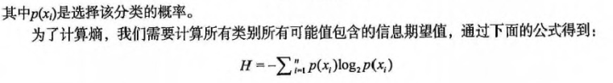
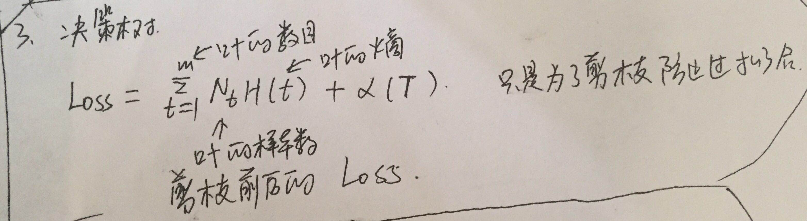
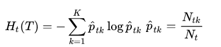
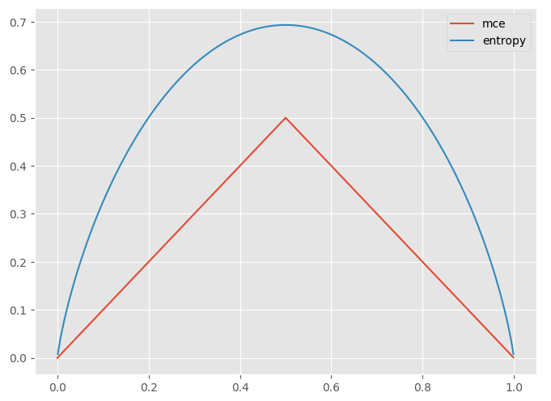

 ## 本章概要 ##

## 写在前面


## 手写笔记


## 基本概念

根据[sklearn官网 - 1.10.Decision Trees](http://scikit-learn.org/stable/modules/tree.html)总结如下：

1. 优势（Advantages）：
	- 易理解，解释性好，易可视化；
	- 数据预处理少；
	- 复杂度O(logN)；
	- 支持多输出；
	- 白盒模型，布尔逻辑；
	- 模型好坏易验证；
	- 容忍先验知识错；

2. 劣势（Disadvantages）：
	- 决策树生成易太大、**过拟合**；（需要**剪枝**、设置树**最大深度**等后续操作。）
	- 模型生成**不稳定**，易受小错误样本影响；
	- 学习最优模型是**N-P难题**，贪心搜索易陷入**局部最优**；（可采用随机初始化生成多个模型。）
	- 不支持非线性逻辑，如**XOR**；
	- **数据不平衡**时生成的树形差；   

3. 使用数据类型：
    * 支持标称变量+连续变量；
* 划分数据集的大原则是：将无序的数据变得更加有序；
* 信息熵 & 信息增益
    * 熵： 熵（entropy）指的是体系的混乱的程度，在不同的学科中也有引申出的更为具体的定义，是各领域十分重要的参量。
    * 信息熵（香农熵）： 是一种信息的度量方式，表示信息的混乱程度，也就是说：信息越有序，信息熵越低。
    例如：火柴有序放在火柴盒里，熵值很低，相反，熵值很高。
    
    * 信息增益： 在划分数据集前后信息发生的变化称为信息增益。
	
* 决策树的一般流程：
    * 收集数据：可以使用任何方法。
    * 准备数据：树构造算法只适用于标称型数据，因此数值型数据必须离散化。
    * 分析数据：可以使用任何方法，构造树完成之后，我们应该检查图形是否符合预期。
    * 训练算法：构造树的数据结构。
    * 测试算法：使用经验树计算错误率。（经验树没有搜索到较好的资料，有兴趣的同学可以来补充）
    * 使用算法：此步骤可以适用于任何监督学习算法，而使用决策树可以更好地理解数据的内在含义。


* [理解决策树](https://zhuanlan.zhihu.com/p/37954086)
    * 基本概念：
        * 决策树是分段线性函数但不是线性函数，它具有非线性建模的能力。只要划分的足够细，
        分段常数函数可以逼近闭区间上任意函数到任意指定精度，因此决策树在理论上可以对任意复杂度的数据进行分类或者回归。
    * 分裂
        * 熵是一个节点纯度的度量
        * 分类：计算每个特征分裂后的熵和节点的熵的变化程度，选择信息增益最大的特征作为分裂特征；
        * 回归： 根据方差最大的分裂，计算分裂后标签的方差和分裂前标签的方差；
    * 何时停止  
        * 对于分类问题，当节点的样本都属于同一类型时停止，但是这样可能会导致树的节点过多、深度过大，产生过拟合问题。
        * 另一种方法是当节点中的样本数小于一个阀值时停止分裂;
    * 叶子节点值的设定：
        * 如果是分类树，则叶子节点的值设置成本节点的训练样本集中出现概率最大的那个类；
        * 如果是回归树，则设置为本节点训练样本标签值的均值。
    * 剪枝
        * 预剪枝可以通过限定树的高度，节点的训练样本数，分裂所带来的纯度提升的最小值来来实现，
        * 后剪枝： 计算剪枝前剪枝后的代价函数，主要是为了防止过拟合。
        
        * 第一步先训练出T0，然后用上面的方法逐步剪掉树的所有非叶子节点，直到只剩下根节点得到剪枝后的树序列。
        这一步的误差计算采用的是训练样本集。
        * 第二步根据真实误差值从上面的树序列中挑选出一棵树作为剪枝后的结果。这可以通过交叉验证实现，
        用交叉验证的测试集对上一步得到的树序列的每一棵树进行测试，得到这些树的错误率，然后根据错误率选择最佳的树作为剪枝后的结果。
  
## 损失函数

* [如何理解决策树的损失函数?](https://www.zhihu.com/question/34075616)
    * 分裂的时候不需要损失函数，剪枝的时候需要；
    * 显而易见，衡量“决策树完全一致”的说明的是【确定性】吧？即确定性越强的损失函数最优值，说明学习方法效果越好。
    即损失函数要满足：熵值越小函数结果越好。
    * 显而易见，对于“决策树而言”，分类确定性越强的，损失就越小吧。
    * 不能完全按照极端的情况去处理，毕竟如果每个叶节点一个样本，咱们的分类也没那么多啊，是吧？这如何是好？机器学习的思路，
    或者说统计学的思路咱们就可以借鉴了，既然咱们不能保证每个最小，那咱们就求他们和的极限，因为决策树的熵都是大于0的，
    所以熵的和最小，就可以保证每个个体都是相对最小的，就可以保证整体最优。所以咱们将决策树的经验损失函数定义为，所有叶节点熵之和：
    ， N(t)是决策树在该节点的样本数,
    
    *  交叉熵对误分率是一个大的改进, 至少两方面相比误分率是有优势的,一是误分率是不可微的(可微是很重要地),
    另外一个是效果要比直接误分率更好(如果效果更差, 当然不会被引进来了).
    
    * 机器学习是一门思考的科学，万变不离其中，多考虑基础，多思考思路，总思维、轻记忆。千万不能死记硬背，碰到迷茫的问题的时候，
    站在解决问题的角度去思考一个方案，你往往就能够明白这些书本中觉得“理所当然的公式”的意义了。
    * 判别模型只是给定输入的一个输出，而生成模型也会带有生成模型的过程，所以判别模型容易过拟合，对于缺失数据无能为力，
    生成模型不容易过拟合，过于缺失数据也有一定的分类能力。
    * 为什么要乘以Nt: 这个叶子节点内部取k个类的不确定度，注意是节点【内部】的不确定度，每个叶子节点可以看作是独立的，
    既然是内部的事情，凭什么暴力的将各个内部的不确定度相加，我们至少到同一个级别的平台再加吧。所以使用节点元素的个数
    做一个加权。如果概率看做频率，那么这里就成了某一类出现的次数。
    

## CART决策树 分类回归树    

1. ID3 是信息增益分支
2. C4.5 是信息增益率分支
3. CART 是 GINI 系数分支
* 工程上总的来说: 
    1. CART 和 C4.5 之间主要差异在于分类结果上，CART 可以回归分析也可以分类，
    2. C4.5 只能做分类；C4.5 子节点是可以多分的，而 CART 是无数个二叉子节点；
* 以此拓展出以 CART 为基础的 “树群” Random forest ， 以 回归树 为基础的 “树群” GBDT 。    
  

### 模型树

* 用树来对数据建模，除了把叶节点简单地设定为常数值之外，还有一种方法是把叶节点设定为分段线性函数，
这里所谓的 分段线性（piecewise linear） 是指模型由多个线性片段组成。
    
## 随机森林