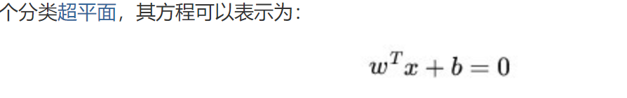

## 本章主要内容
* why svm
    * 减少计算量， 只有支持向量起作用；
    * 逻辑回归中所有点都要算一遍
* how solve svm问题
    * 两种解法：
    1. 正规方程：
        * 转换为对偶问题
        * 使用SMO解决对偶问题，获得原问题的解
        * 需要目标函数，不需要损失函数
    2. 梯度下降：
        * hingloss=max(1-z, 0): 只有间隔内部的点起作用

## 写在前面

* 优点：泛化错误率低， 计算开销不大， 结果易解释；
* 缺点：对参数调节和核函数的选择敏感，原始分类器不加修改仅适用于处理二分类问题
* 使用数据类型： 数值型和标称型数据

* SVM有很多种实现，最流行的一种实现是： 序列最小优化(Sequential Minimal Optimization, SMO)算法。
    * SMO算法是将大优化问题分解的结果与将它们作为整体来求解的。这些小优化问题来求解；
    * 工作原理：每次循环选择两个 alpha 进行优化处理，一旦找出一对合适的 alpha，那么就增大一个同时减少一个。
        * 这里指的合适必须要符合一定的条件
        1. 这两个 alpha 必须要在间隔边界之外；
        2. 这两个 alpha 还没有进行过区间化处理或者不在边界上。

* [支持向量机通俗导论（理解SVM的三层境界）](https://blog.csdn.net/macyang/article/details/38782399)

    * 它是一种二类分类模型，其基本模型定义为特征空间上的间隔最大的线性分类器，即支持向量机的学习策略便是间隔最大化，
    最终可转化为一个凸二次规划问题的求解。
    

* [第6章 支持向量机](https://github.com/apachecn/MachineLearning/blob/master/docs/6.%E6%94%AF%E6%8C%81%E5%90%91%E9%87%8F%E6%9C%BA.md)
    * 松弛变量：允许一定的样本在间隔内，但对于这部分样本做惩罚，约束

## svm 

* 支持向量的数目存在一个最优值，SVM的优点在于它能对数据进行高效分类，如果支持向量太少，就可能会得到一个很差的决策边界，
如果支持向量太多，也就相当于每次都利用真个数据集进行分类，这号给你分类方法称为knn。
* knn效果确实不错，但是需要保留所有的训练样本，而对于支持向量机而言，其需要保留的样本少了很多（支持向量）。
* 支持向量机是一种分类器。之所以叫做机是因为它会产生一个二值决策结果，即它是一种决策机。支持向量机的泛化能力错误率较低，
也就是说它具有良好的学习能力且学到的结果具有良好的推广性，这些优点使得支持向量机十分流行。

## 杂谈

### 学习本章使用的内容

* 优达学城 《机器学习工程师-纳米学位》
* 《机器学习》周志华
    * 基本理论都能估计到，但是写的比较高深，需要一定的辅助，
    * 可以选择博客，补充概念
* 《python大战机器学习》 
    * 第一是对西瓜书的补充，第二是API实现，学习已有的函数的用法
* 吴恩达机器学习视频 SVM一节
    * 理解了很多的概念，算得上一个层次的视角，但是需要一定的基础
