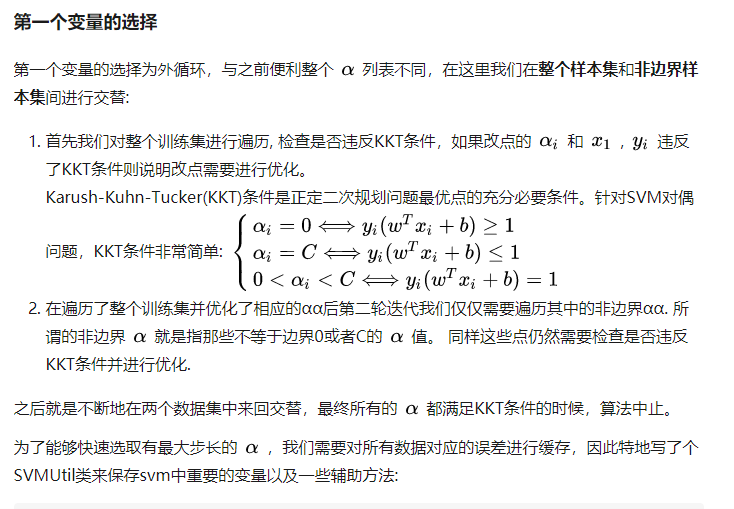
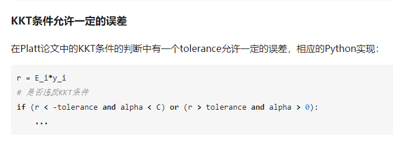

## SMO算法

### SMO中启发式选择变量

* 在SMO算法中，我们每次需要选取一对 \alpha 来进行优化，
通过启发式的选取我们可以更高效的选取待优化的变量使得目标函数下降的最快。
针对第一个 \alpha_1 和第二个\alpha_2 Platt SMO采取不同的启发式手段。

#### 第一个变量的选择

* 第一个变量的选择为外循环，与之前便利整个 \alpha 列表不同，在这里我们在整个样本集和非边界样本集间进行交替:

### 参考文献
* [支持向量机(SVM)（五）-- SMO算法详解](https://blog.csdn.net/u011067360/article/details/26503719)
* [机器学习算法实践-SVM中的SMO算法](https://zhuanlan.zhihu.com/p/29212107)
* [支持向量机系列（5）——SMO算法解对偶问题](https://zhuanlan.zhihu.com/p/28299882)
* [机器学习算法实践-Platt SMO和遗传算法优化SVM](https://zhuanlan.zhihu.com/p/30173372)

