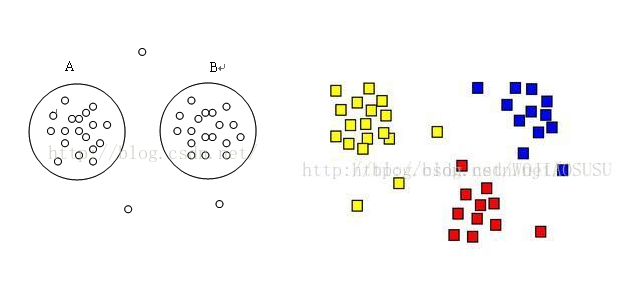

## 密度聚类

* 划分方法聚类算法与层次聚类算法把距离（欧氏距离，闵可夫斯基距离，曼哈顿距离）作为两个样本或者两个簇之间相似度的评价指标，
因此导致了划分方法聚类算法和层次聚类算法旨在发现球状簇，对任意形状的聚类簇比较吃力。



* 可以把簇看做数据空间中被稀疏区域分开的稠密区域，基于密度聚类算法假设聚类结构能够通过样本分布的紧密程度确定，
* 基于密度聚类算法的主要特点是：
    1. 发现任意形状的簇
    2. 处理噪声
    3. 一次扫描
    4. 需要密度参数作为终止条件
* 主要的聚类算法有：DBSCAN，OPTICS，DENCLUE等。


