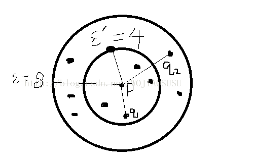


### OPTICS算法，全称是Ordering points to identify the clustering structure

* 基于密度的簇是关于领域阈值单调的，在DBSCAN中，对于固定的MinPts值和两个领域R1<r2，关于r1的簇一定是关于r2簇的子集、
意味着，如果两个对象在同一个基于密度的簇中，则他们也一定在同一个具有较低密度的簇中。

* DBSCAN使用了全局参数聚类效果不是很好，尤其是高维数据集，数据倾斜可能比较严重，为了克服全局参数这一缺点，
引入了OPTICS算法，OPTICS并不显式的产生聚类簇，而是输入点排序。
这个排序是属于分析对象的线性表（按距离的远近），并且代表了数据的基于密度的聚类结构。
OPTICS聚类算法不需要用户提供特定的密度阈值，簇排序可以用来提取基本的聚类信息，导出内在的聚类结构。

* 基本概念：
    * 核心距离：对象p的核心距离是最小的ξ’值，即使得对象p的ξ’领域内至少有MinPts个对象，即ξ’是使得对象p成为
    核心对象的最小半径阈。如果p不是关于ξ’和MinPts的核心对象，那么p的核心距离就没有定义
    * 可达距离：从对象q到对象p的可达距离是使p从q密度可达的最小半径值。q必须是核心对象，并且p必须在q的领域内，
    从q到p的可达距离max{core_distance(q), dist(p, q)}，如果q不是核心对象，那么可达距离没有定义。
    可达距离是核心对象（必须要有核心对象）与其邻域点的距离（邻域为ξ范围，不是ξ’范围）。
    
    > *下面是公式参考*
    
    

* [OPTICS算法-基础讲解](https://blog.csdn.net/wojiaosusu/article/details/57416635)
* [维基百科](https://en.wikipedia.org/wiki/OPTICS_algorithm)
* [OPTICS算法-提炼说明](https://blog.csdn.net/xuanyuansen/article/details/49471807)

* OPTICS算法思想如下所示：
  
    * 输入：数据样本D，初始化所有点的可达距离和核心距离为MAX，半径，和最少点数。
    
    1. 建立两个队列，有序队列（核心点及该核心点的直接密度可达点），结果队列（存储样本输出及处理次序）
    
    2. 如果D中数据全部处理完，则算法结束，否则从D中选择一个未处理且未核心对象的点，将该核心点放入结果队列，
    该核心点的直接密度可达点放入有序队列，直接密度可达点并按可达距离升序排列；
    
    3. 如果有序序列为空，则回到步骤2，否则从有序队列中取出第一个点；
        * 判断该点是否为核心点，不是则回到步骤3，是的话则将该点存入结果队列，如果该点不在结果队列；
        * 该点是核心点的话，找到其所有直接密度可达点，并将这些点放入有序队列，且将有序队列中的点按照可达距离重新排序，
        如果该点已经在有序队列中且新的可达距离较小，则更新该点的可达距离。
        * 重复步骤3，直至有序队列为空。
    
    4. 算法结束。
    
* 最后排序结果的输出：
    1. 从结果队列中按顺序取出点，如果该点的可达距离不大于给定半径，则该点属于当前类别，否则至步骤2
    2. 如果该点的核心距离大于给定半径，则该点为噪声，可以忽略，否则该点属于新的聚类，跳至步骤1；
    3. 结果队列遍历结束，则算法结束  

* 总结上面过程为三步：
    1. 对总数据D中的核心对象进行遍历
    2. 取出核心对象后，建立两个队列，有序队列存放核心对象以及核心对象的密度可达点，并且按照可达距离进行升序排列
    3. 对有序队列进行遍历，判断每一个点是否是核心对象，如果是的话，将其密度可达点加入到有序队列中，将有序队列迭代输出的结果
    放入结果队列中，同时在数据D汇总将其删掉，有序队列为空了，开始下一个核心对象，开始1。

* [代码实现](cluster/optics.py)
