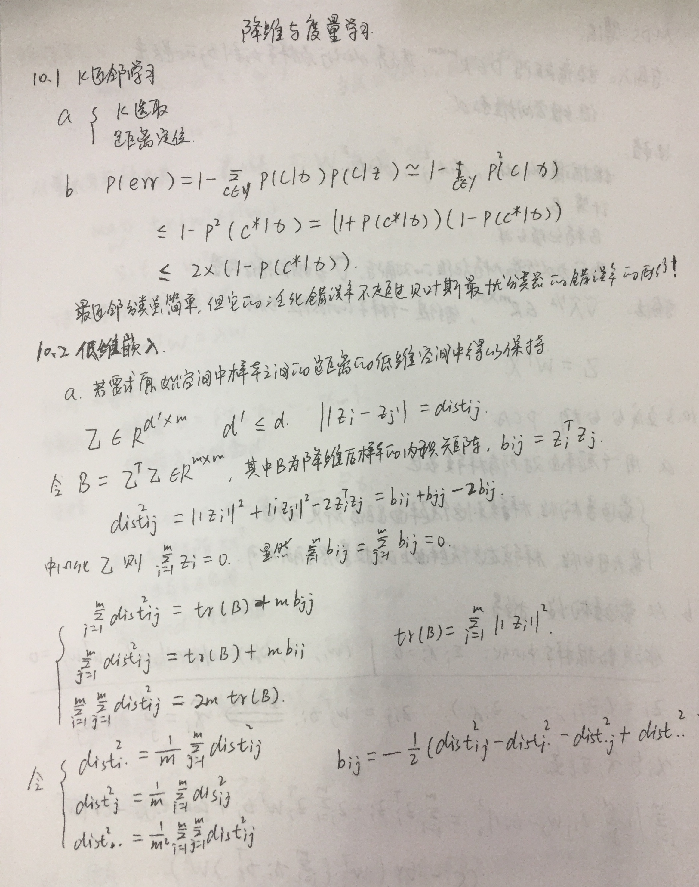
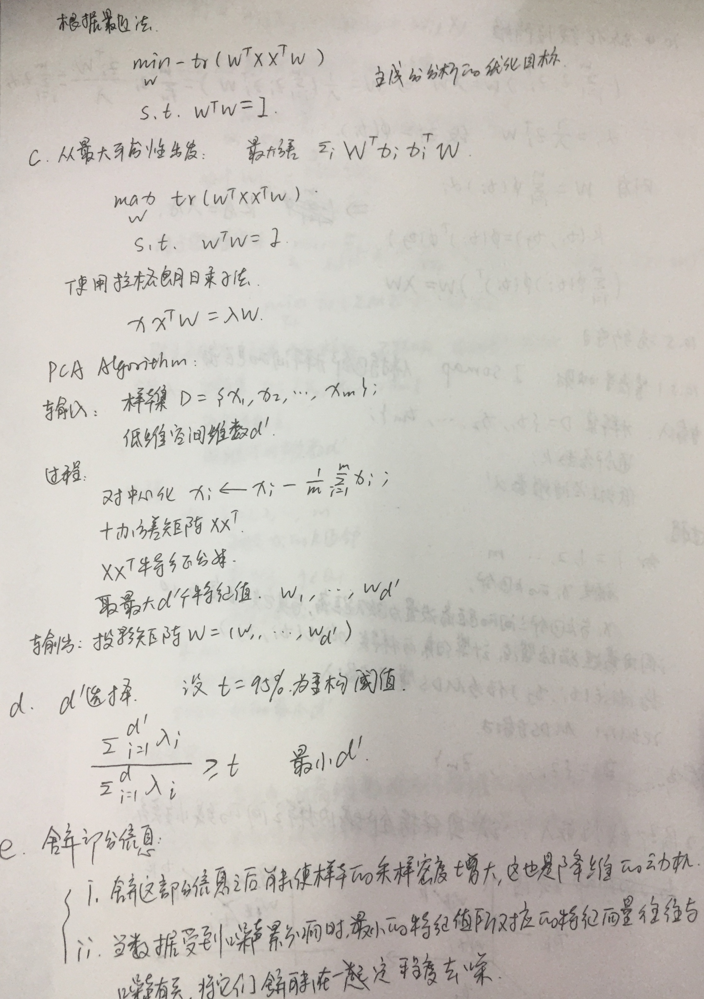
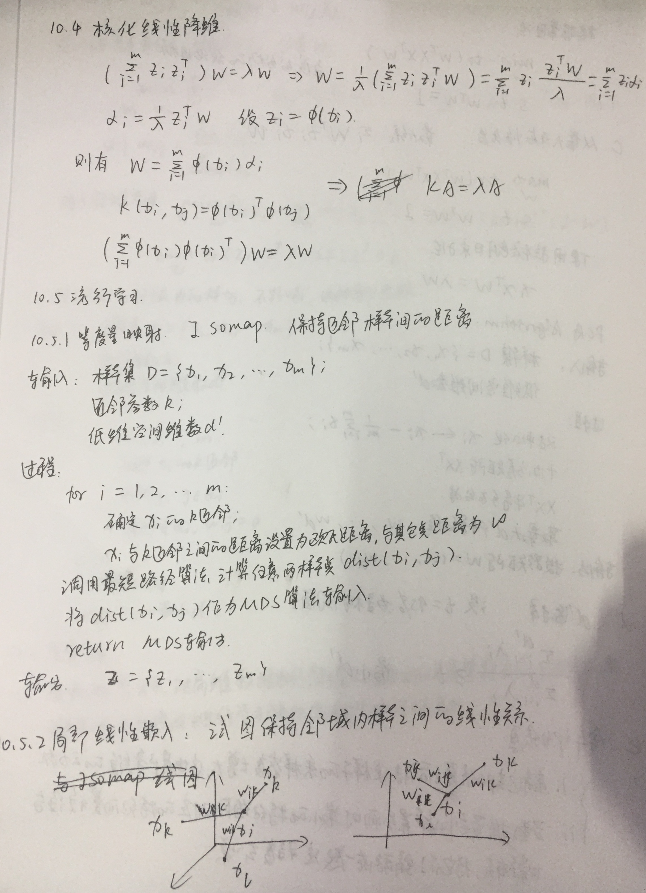
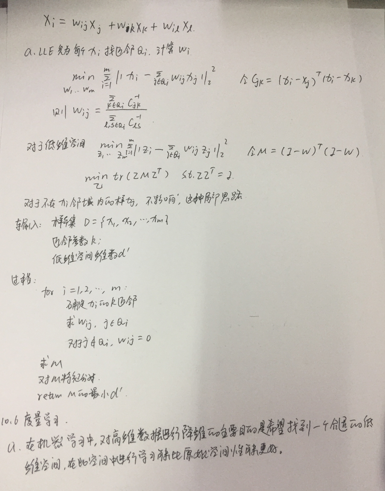

## 降维和度量学习相关

* PCA学习
* 

## 写在前面




## 手写笔记









## 代码

* [knn算法用于分类和回归](降维与度量学习/knn)
* [降维-流形学习-等度量映射](降维与度量学习/isomap.py)
* [降维-MDS算法](降维与度量学习/mds.py)
* [主成分分析算法--线性](降维与度量学习/pca.py)
* [核主成分算法--非线性](降维与度量学习/kpca.py)
* [局部线性嵌入： 试图保持领域内样本之间的线性关系。](降维与度量学习/lle.py)
